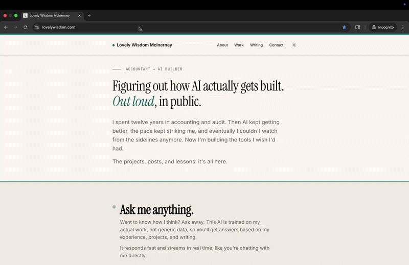

# Claude Code Starter Pack

Your first AI-built project, guided step by step. No coding experience needed.

This is a Claude Code skill that walks you through building your first project. It installs the tools you need, asks what you want to build, sets up your project files, and launches an interactive brainstorming session. From there, Claude guides you through planning, building, testing, and shipping.

Hi, I'm [Lovely](https://lovelywisdom.com). I built my portfolio website with a personal AI chatbot entirely with Claude Code. Follow these 3 simple steps and build something cool with Claude Code.



## Quick Start

### Step 1. Install Claude Code

On Mac:

```
curl -fsSL https://claude.ai/install.sh | bash
```

On Windows:

```
irm https://claude.ai/install.ps1 | iex
```

### Step 2. Create a project folder and launch Claude in it

On Mac:

```
mkdir -p ~/Documents/my-first-project && cd ~/Documents/my-first-project && claude
```

On Windows (PowerShell):

```
mkdir $env:USERPROFILE\Documents\my-first-project; cd $env:USERPROFILE\Documents\my-first-project; claude
```

This creates a project folder in your Documents, moves into it, and starts Claude. Claude only has access to this folder, not your whole computer.

### Step 3. Install the starter pack

When Claude starts, paste this:

> **Install the starter pack from github.com/muggl3mind/Claude-Code-Starter-Pack and run /starter-pack**

Claude installs the starter pack (like an app that lives inside Claude) and launches the guided experience. You only need to do this once. After that, type `/starter-pack` in any project folder to start a new project.

## What It Does

1. **Installs tools** (first time only). Three tools that give Claude structured workflows: gstack (planning, review, deployment), superpowers (brainstorming, execution), and LSP servers (code intelligence so Claude can navigate your project faster and catch errors as you build). The LSP step also runs `npm i -g pyright typescript-language-server typescript`. The plugins are just wiring. This command installs the actual servers those plugins call. Without them, the plugins are silent and Claude can't read your code properly.
2. **Interviews you**. Asks what you're building, who it's for, what content you have, how it should look. One question at a time.
3. **Sets up your project**. Generates a CLAUDE.md (your project preferences) and LESSONS.md (where Claude logs mistakes so it doesn't repeat them). Claude will ask you to paste a quick command so it follows those rules right away.
4. **Launches brainstorming**. Runs /office-hours, an interactive session that shapes your idea before you start building.

After brainstorming, use these to keep going:

| Command | What it does |
|---------|-------------|
| `/plan-ceo-review` | Challenges your scope, finds gaps |
| `/plan-eng-review` | Locks the technical approach |
| `/executing-plans` | Builds step by step |
| `/qa` | Tests and fixes bugs |
| `/ship` | Pushes to GitHub and deploys |

## What's in This Repo

| File | Purpose |
|------|---------|
| `SKILL.md` | The interactive guide. This is what runs when you type /starter-pack. |
| `references/commands.md` | Cheat sheet for all slash commands. |
| `references/debugging.md` | Step-by-step debugging process. |
| `references/new-skill.md` | How to create your own slash command. |
| `references/project-setup.md` | Checklist for project files (ARCHITECTURE.md, TODOS.md, etc). |
| `.gitignore` | Keeps secrets and sensitive files out of your projects. |

## Requirements

- A Claude Pro/Max subscription or API credits
- A GitHub account (github.com, free)
- A terminal (Terminal on Mac, PowerShell on Windows)

## License

MIT
